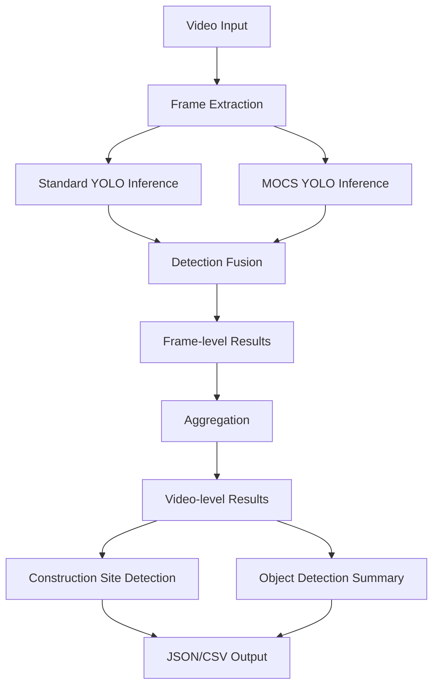

# Dual YOLO Video Inference System

A comprehensive system for processing videos using both standard YOLOv8 and fine-tuned MOCS (construction detection) models to identify objects and construction sites.

## Features

- **Dual Model Inference**: Simultaneously runs standard YOLOv8 and fine-tuned MOCS model
- **Construction Site Detection**: Automatically identifies construction sites based on equipment presence (excludes workers)
- **Flexible Frame Extraction**: Configurable frame sampling for efficient processing
- **Multiple Aggregation Methods**: Five different methods to aggregate frame-level results
- **Batch Processing**: Process entire directories of videos
- **Comprehensive Output**: JSON and CSV reports with detailed per-video analysis

## Architecture

### Modules

1. **video_frame_extractor.py**: Handles video loading and frame extraction
2. **dual_yolo_inference.py**: Performs inference with both YOLO models
3. **output_fusion.py**: Fuses and aggregates detection results
4. **batch_processor.py**: Processes multiple videos from directories
5. **dual_yolo_inference_pipeline.ipynb**: Interactive notebook for demonstrations

## Installation

```bash
pip install ultralytics opencv-python pandas tqdm matplotlib seaborn pillow
```

## Quick Start

### Single Video Processing

```python
from video_frame_extractor import VideoFrameExtractor
from dual_yolo_inference import DualYOLOInference
from output_fusion import create_fusion_engine

# Initialize components
extractor = VideoFrameExtractor(frame_skip=30)
inference = DualYOLOInference(
    standard_model_path='yolov8n.pt',
    mocs_model_path='path/to/mocs_model.pt',
    conf_threshold=0.5
)
fusion = create_fusion_engine(aggregation_method='weighted_average')

# Process video
frames = list(extractor.extract_frames('video.mp4'))
frame_results = inference.infer_frames(frames)
video_result = fusion.fuse_video_results('video.mp4', frame_results)

# Check results
print(f"Construction site: {video_result.is_construction_site}")
print(f"Confidence: {video_result.construction_confidence:.2%}")
print(f"Equipment: {video_result.construction_equipment}")
```

### Batch Processing

```python
from batch_processor import process_video_directory

# Process entire directory
results = process_video_directory(
    directory_path='./videos',
    standard_model_path='yolov8n.pt',
    mocs_model_path='path/to/mocs_model.pt',
    output_dir='./results',
    frame_skip=30,
    aggregation_method='weighted_average'
)

# Results are automatically saved to output_dir
```

## Configuration Options

### Frame Extraction

- `frame_skip`: Process every nth frame (default: 30 for ~1fps at 30fps video)
- `resize_dim`: Optional resize dimensions for frames

### Inference

- `conf_threshold`: Confidence threshold for detections (default: 0.5)
- `iou_threshold`: IOU threshold for NMS (default: 0.45)
- `device`: 'cuda' or 'cpu'

### Aggregation Methods

- `max_confidence`: Takes detection with highest confidence
- `average_confidence`: Averages confidence across frames
- `majority_vote`: Most frequently detected class
- `weighted_average`: Weighted by confidence and frequency (recommended)
- `threshold_percentage`: Detected in X% of frames

### Construction Site Detection

- `construction_threshold`: Minimum percentage of frames with equipment (default: 0.3)
- Equipment classes exclude "Worker" to focus on machinery

## Output Format

### JSON Output

```json
{
  "video_path": "video.mp4",
  "total_frames": 100,
  "is_construction_site": true,
  "construction_confidence": 0.85,
  "construction_equipment": ["Excavator", "Truck", "Crane"],
  "standard_detections": [
    {
      "class_name": "person",
      "confidence": 0.92,
      "detection_count": 78,
      "detection_percentage": 78.0
    }
  ],
  "mocs_detections": [...]
}
```

### CSV Summary

| Video      | Frames | Construction Site | Confidence | Equipment        | Top Detection |
| ---------- | ------ | ----------------- | ---------- | ---------------- | ------------- |
| video1.mp4 | 100    | Yes               | 85.2%      | Excavator, Truck | person (92%)  |

## Construction Equipment Classes

The system detects the following construction equipment (from MOCS dataset):

- Static crane
- Hanging head
- Crane
- Roller
- Bulldozer
- Excavator
- Truck
- Loader
- Pump truck
- Concrete mixer
- Pile driving

**Note**: "Worker" and "Other vehicle" classes are intentionally excluded from construction site detection logic to focus on specific construction equipment.

## Performance Considerations

### Processing Speed

- **Frame Skip**: Higher values = faster processing, lower accuracy
  - `frame_skip=30`: ~1 fps (recommended for most cases)
  - `frame_skip=60`: ~0.5 fps (fast processing)
  - `frame_skip=15`: ~2 fps (better temporal coverage)

### Memory Usage

- Frame extraction is done via generator to minimize memory footprint
- For batch processing, videos are processed sequentially

### GPU Acceleration

- Use `device='cuda'` for ~10-50x speedup depending on GPU
- Automatically falls back to CPU if CUDA unavailable

## Usage Examples

### Example 1: Custom Aggregation

```python
from output_fusion import create_fusion_engine

# Create custom fusion engine
fusion = create_fusion_engine(
    aggregation_method='max_confidence',
    min_detection_percentage=5.0,  # Lower threshold
    construction_threshold=0.2  # More sensitive
)
```

### Example 2: High Accuracy Mode

```python
# Process with more frames for better accuracy
results = process_video_directory(
    directory_path='./videos',
    frame_skip=10,  # Process more frames
    conf_threshold=0.6,  # Higher confidence
    aggregation_method='weighted_average'
)
```

### Example 3: Fast Processing Mode

```python
# Quick processing for large video sets
results = process_video_directory(
    directory_path='./videos',
    frame_skip=60,  # Skip more frames
    conf_threshold=0.4,  # Lower threshold
    aggregation_method='max_confidence'
)
```

## Directory Structure

```
video_inference/
├── video_frame_extractor.py       # Frame extraction module
├── dual_yolo_inference.py         # Dual YOLO inference engine
├── output_fusion.py               # Result fusion and aggregation
├── batch_processor.py             # Batch processing utilities
├── dual_yolo_inference_pipeline.ipynb  # Interactive demo notebook
├── README.md                      # This file
└── results/                       # Output directory (created automatically)
    ├── video_inference_results_*.json
    ├── video_inference_summary_*.csv
    └── detailed_reports_*/
        └── video_name_report.json
```

## Workflow



## API Reference

### VideoFrameExtractor

```python
extractor = VideoFrameExtractor(frame_skip=1, resize_dim=None)
frames = extractor.extract_frames(video_path)  # Generator
info = extractor.get_video_info(video_path)
```

### DualYOLOInference

```python
inference = DualYOLOInference(
    standard_model_path='yolov8n.pt',
    mocs_model_path='mocs.pt',
    conf_threshold=0.5,
    device='cuda'
)
result = inference.infer_frame(frame, frame_number)
results = inference.infer_frames(frames_list)
```

### OutputFusion

```python
fusion = create_fusion_engine(
    aggregation_method='weighted_average',
    min_detection_percentage=10.0,
    construction_threshold=0.3
)
video_result = fusion.fuse_video_results(video_path, frame_results)
```

### BatchVideoProcessor

```python
processor = BatchVideoProcessor(
    standard_model_path='yolov8n.pt',
    mocs_model_path='mocs.pt',
    frame_skip=30
)
results = processor.process_directory(video_dir, output_dir)
```

## Troubleshooting

### Issue: Out of Memory

**Solution**: Increase `frame_skip` or use CPU instead of GPU

### Issue: Low Detection Accuracy

**Solution**: Decrease `frame_skip`, lower `conf_threshold`, or adjust `min_detection_percentage`

### Issue: Too Many False Positives

**Solution**: Increase `conf_threshold` or `min_detection_percentage`

### Issue: Construction Sites Not Detected

**Solution**: Lower `construction_threshold` or check if MOCS model is loaded correctly

## License

This project uses YOLOv8 (AGPL-3.0) and is built for research and educational purposes.

## Citation

If you use this system in your research, please cite:

- YOLOv8: Ultralytics
- MOCS Dataset: [Original paper/source]

## Contributing

Contributions welcome! Please ensure code follows the existing structure and includes appropriate documentation.

## Contact

For questions or issues, please open an issue in the repository.
